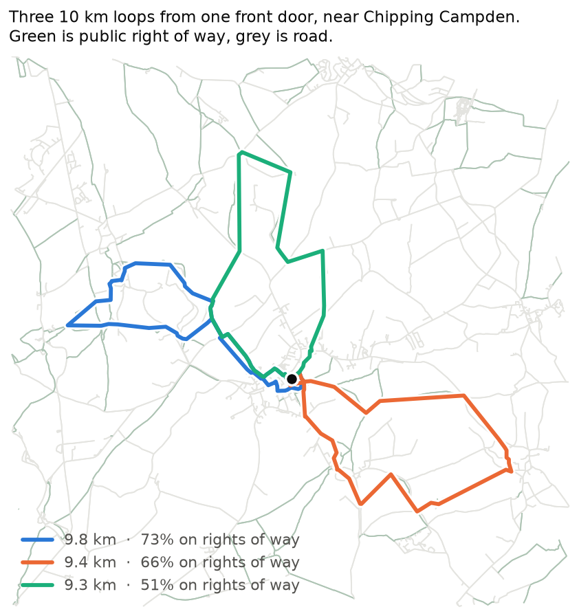

# pathrun

Generates circular running routes of a target distance that stick to public footpaths and avoid roads.



Ask Strava for a 10 km loop and it will happily send you down a B road with no pavement, past a
public footpath running parallel to it through a field. pathrun loads the rights of way from
OpenStreetMap and treats them as the good option rather than an afterthought.

## Try it

```
uv sync
cp .env.example .env                        # add your postcode
uv run python scripts/fetch_network.py      # one minute, cached afterwards
```

Then open `notebooks/02_route_workbench.ipynb`, set a distance, and run it. You get candidate loops
scored on how much of each is on a right of way and how much doubles back, a map to look at them on,
and a GPX export of the one you pick.

Any app that reads GPX will follow it. OsmAnd is free and works offline. Garmin watches take the same
file copied into `GARMIN/NewFiles/`. Strava is not an option, since creating a route there needs a
subscription and its API has no endpoint for making one.

## How it works

The map is a graph: junctions are nodes and the stretch between them is an edge. A **strategy**
prices every edge as its length times a penalty, so a footpath at 0.35 means a route nearly three
times longer is still worth it. It reads `designation` for legal rights of way, then `maxspeed`,
`sidewalk`, `surface` and `foot` where present. A missing tag never counts against an edge, because
most of the network is only partly tagged.

Loops are the hard part. The cheapest route from your house to your house is to stay where you are,
and constraining a circuit to a target length has no exact solution. So the generator samples
bearings, routes out and back, measures what came back, and corrects until the length is close.

`notebooks/01_a_map_is_a_graph.ipynb` walks through all of that against real data.

## Personal records

`metrics.py` computes splits, paces and records from GPX files in `data/runs/`, so they survive
whichever tracking service you happen to be using. Records are best efforts: the quickest you covered
a distance anywhere inside any run, not your fastest run of that length.

## Related tools

[Trail Router](https://trailrouter.com) does the closest thing to this, free and in a browser, with
no setup. Try it first. It optimises for greenery, meaning parks and water and hiking routes, rather
than for legal rights of way, and it does not weigh road danger. If that distinction does not matter
to you, use Trail Router. RoutMix, Komoot and Garmin Connect all generate round trips too.

What this does differently is treat UK rights of way as the thing to maximise, penalise roads by
speed limit and absence of pavement, show its working on every candidate, and let you change the
weights yourself.

## Layout

```
pathrun/
    config.py      settings, read from .env
    network.py     fetching and caching the graph
    strategy.py    what counts as a good route
    cost.py        applying a strategy, and scoring a route
    loops.py       circular route generation
    gpx.py         GPX export
    runs.py        loading GPX exported from Strava
    metrics.py     splits, paces and personal records
notebooks/         01 explains the graph, 02 is the workbench
tests/
```

Everything runs through uv: `uv run pytest`, `uv run python scripts/...`.

After cloning, run `uv run nbstripout --install` so notebook outputs stay out of git. Your `.env`,
cached maps and GPX files are already ignored.
